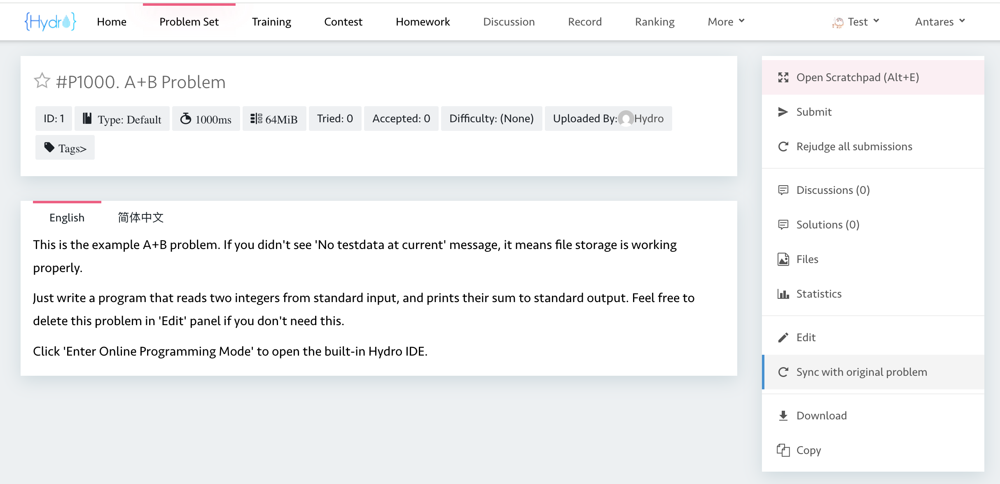
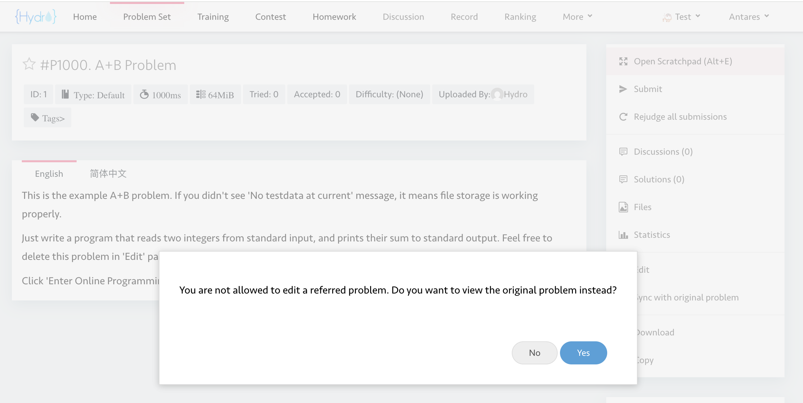
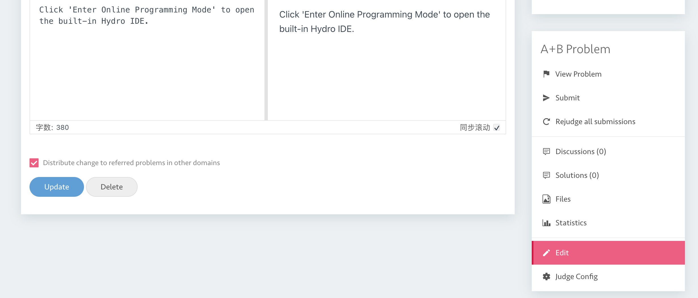

# Hydro Addon: Problem Content Sync

This addon provides features to sync problem content across different domains in [Hydro](https://github.com/hydro-dev/Hydro). It allows users to sync changes from an original problem to its referred problems.

## Features

- **Sync with Original Problem**: Users can sync the content of a problem with its original problem, ensuring that all referred problems are up-to-date with the latest changes.

    

- **Disable Editing Referred Problems**: The admin can disable editing of referred problems to ensure that all changes are made through the original problem.
    

- **Distribute Change**: When enabled, changes made to the original problem can be distributed to all referred problems in other domains. This feature requires the user to have the `PRIV_MANAGE_ALL_DOMAIN` privilege.
    

## Installation

1. Clone the repository:

    ```bash
    git clone https://github.com/tywzoj/hydro-addon-problem-content-sync.git
    ```

2. Apply the addon to your Hydro instance:

    ```bash
    hydrooj addon add /path/to/hydro-addon-problem-content-sync
    pm2 restart hydrooj
    ```

## Configuration

The addon provides the following configuration options:

- `allow_distribute_problem_change_to_other_domains`: A boolean setting to enable or disable the distribution of changes from the original problem to referred problems.

- `disable_edit_referred_problem`: A boolean setting to enable or disable editing of referred problems.

You can login as an administrator on Hydro and navigate to the system configuration page to modify these settings.

## License

This addon is licensed under the AGPL-3.0 License. See the [LICENSE](LICENSE) file for more details.
