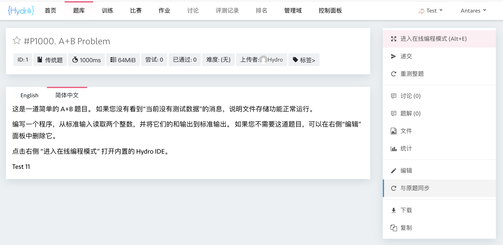
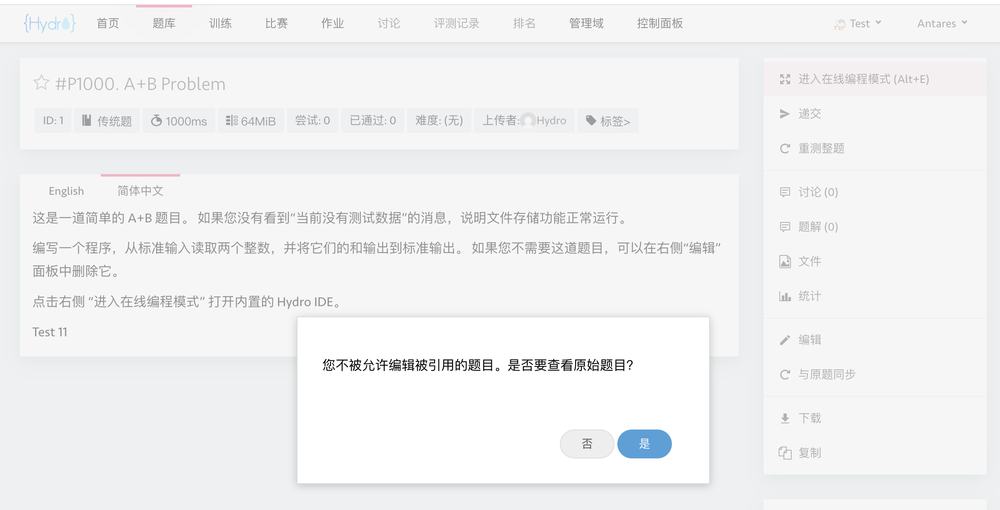
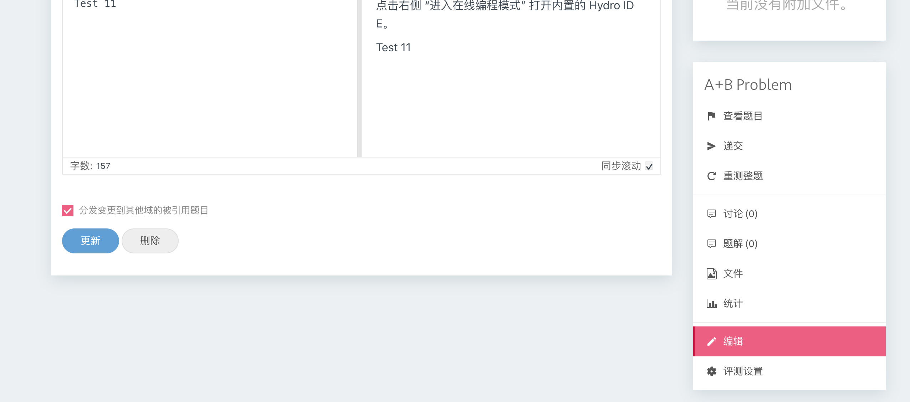

# Hydro Addon: 题目内容同步

这个插件为 [Hydro](https://github.com/hydro-dev/Hydro) 提供了跨不同域同步题目内容的功能。它允许用户将原题的更改同步到被引用题中。

## 功能

- **与原题同步**：用户可以将当前题目内容与其原题同步，确保所有被引用题都保持最新。
    

- **禁止编辑被引用题**：管理员可以禁止直接编辑被引用题，确保所有改动都通过原题进行。
    

- **分发变更**：启用后，可以将原题的更改分发到其他域中的所有被引用题。此功能要求用户具有 `PRIV_MANAGE_ALL_DOMAIN` 权限。
    

## 安装

1. 克隆仓库：

    ```bash
    git clone https://github.com/tywzoj/hydro-addon-problem-content-sync.git
    ```

2. 将插件添加到你的 Hydro 实例：

    ```bash
    hydrooj addon add /path/to/hydro-addon-problem-content-sync
    pm2 restart hydrooj
    ```

## 配置

插件提供以下配置项：

- `allow_distribute_problem_change_to_other_domains`：用于启用或禁用将原题变更分发到其他域的被引用题。

- `disable_edit_referred_problem`：用于启用或禁用对被引用题的直接编辑。

你可以使用管理员账号登录 Hydro，并在系统配置页面中修改这些配置项。

## License

本插件基于 AGPL-3.0 许可证发布。详见 [LICENSE](LICENSE) 文件。
